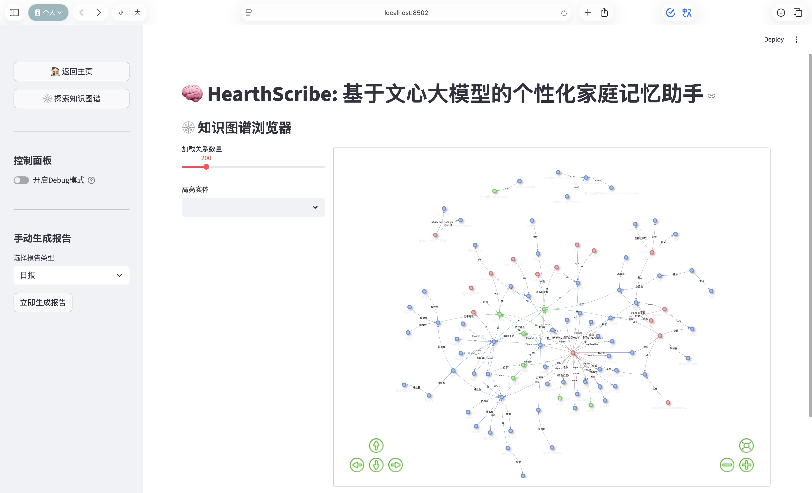
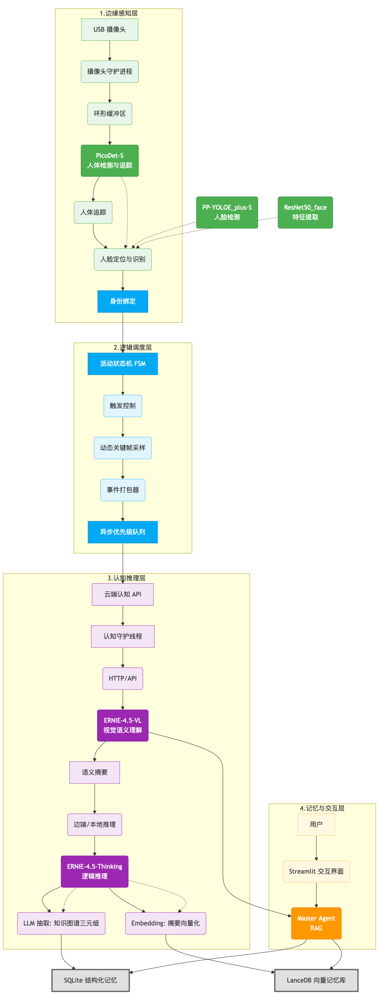

# HearthScribe: 基于文心大模型的智能家庭记忆助手

**HearthScribe** 是一个深度集成 **百度文心大模型** 的智能代理系统。它不仅仅是一个摄像头监控程序，更是一个拥有“感知”、“认知”和“记忆”能力的家庭观察者。

本项目充分利用了文心大模型强大的多模态理解与逻辑推理能力。它能实时识别画面人物，利用 **ERNIE-4.5-VL** 捕捉并理解生活瞬间，生成语义化摘要，并构建本地知识图谱。用户可以通过自然语言与系统对话，检索过去的记忆，或生成基于事实的生活报告。




## ✨ 核心功能

*   **👁️ 智能感知与身份识别**
    *   使用 **YOLOv8** 进行边缘端实时人体检测与追踪。
    *   集成 **Face Recognition**，自动识别已注册的家庭成员身份。
    *   **摄像头守护进程**：具备断线自动重连和错误恢复机制，确保持续稳定运行。

*   **🧠 文心驱动的语义记忆**
    *   **动态采样**：基于活动检测自动开始/停止录制，过滤无效画面。
    *   **视觉认知 (ERNIE-4.5-VL)**：调用文心视觉大模型分析事件截图，精准理解人物行为、物体交互与场景细节（如“lizhijun正在书桌前阅读，手里拿着一杯咖啡”）。
    *   **知识提取**：从摘要中提取实体（人物、物品、地点）和关系，构建结构化知识图谱。

*   **💾 双重记忆存储 (RAG)**
    *   **向量记忆 (LanceDB)**：存储事件摘要的语义向量，支持模糊搜索。
    *   **结构化记忆 (SQLite)**：存储元数据、知识图谱三元组和原始图片路径。

*   **💬 自然语言交互**
    *   **智能路由**：Master Agent 能够理解用户意图，自动调度“记忆检索”、“图谱推理”或“总结报告”专家。
    *   **多轮问答 (ERNIE-4.5)**：基于检索增强生成 (RAG)，利用文心大模型优秀的中文理解能力，用自然语言流畅回答关于家庭历史的复杂问题。
    *   **自动报告**：支持生成日报、周报，总结特定时间段内的活动模式。

## 🏗️ 系统架构与运行逻辑

系统主要由以下几个核心模块组成：

1.  **感知层 (`perception_processor.py`)**:
    *   处理视频流，利用 YOLO 追踪 ID，结合人脸识别将 ID 映射为具体姓名。
2.  **记忆流 (`memory_stream.py`)**:
    *   作为短期记忆缓冲区。当画面有人活动时开始缓存帧，静止超过阈值（如60秒）则判定事件结束，打包成“Event”。
3.  **认知核心 (`cognitive_core.py`)**:
    *   接收打包的 Event，选取关键帧发送给 **LVM (视觉大模型)** 生成摘要。
    *   调用 **LLM** 从摘要中提取 Knowledge Graph (KG) 数据。
4.  **长期记忆 (`long_term_memory.py`)**:
    *   将文本摘要通过 Embedding 模型转换为向量存入 LanceDB。
    *   将 KG 数据和事件元数据存入 SQLite。
5.  **代理交互 (`master_agent.py` & `web_utils.py`)**:
    *   处理用户查询，协调各模块检索信息，最终生成回答。



## 📂 目录结构

```text
HearthScribe/
├── main.py                 # 主程序入口：启动摄像头采集与后台处理循环
├── config.py               # 全局配置文件
├── .env                    # 环境变量（API Key等）
├── requirements.txt        # 依赖库
├── known_faces/            # 已知人脸库目录
│   ├── zhangsan/           # 张三的照片文件夹
│   └── lisi/               # 李四的照片文件夹
├── memory_db/              # 数据库存储路径 (自动生成)
├── event_images/           # 事件图片存储路径 (自动生成)
└── src/
    ├── agent/              # 代理与路由逻辑
    ├── cognition/          # 视觉理解与认知核心
    ├── memory/             # 向量库与数据库管理
    ├── perception/         # YOLO与人脸识别
    └── app/                # UI与任务接口
```

## 🚀 快速开始

### 1. 环境准备

建议使用 Python 3.10+ 环境。

```bash
# 克隆仓库
git clone https://github.com/ZhijunLStudio/HearthScribe.git
cd HearthScribe

# 安装依赖
pip install -r requirements.txt
```

### 2. 模型与配置

#### 自动下载的模型
首次运行时，代码会自动从 HuggingFace 或 Ultralytics 下载以下模型到本地：
*   **YOLOv8n.pt**: 用于人体检测 (轻量级)。
*   **SentenceTransformer (all-MiniLM-L6-v2)**: 用于生成文本向量嵌入。

#### 配置文件 (.env)
在项目根目录创建 `.env` 文件，配置你的大模型 API（支持 OpenAI 格式，可接入本地 vLLM 或云端服务）：

```ini
# 视觉大模型配置 (LVM)
LVM_API_KEY=sk-xxxx
LVM_BASE_URL=https://api.example.com/v1
LVM_MODEL_NAME=ernie-4.5-turbo-vl  # 或本地模型名称

# 语言大模型配置 (LLM)
LLM_API_KEY=sk-xxxx
LLM_BASE_URL=https://api.example.com/v1
LLM_MODEL_NAME=ernie-4.5-21b-a3b-thinking
```

### 3. 录入人脸数据
在 `known_faces` 目录下创建以人名命名的文件夹，并放入该人的清晰面部照片（jpg/png）。
例如：
*   `./known_faces/Daddy/photo1.jpg`
*   `./known_faces/Mom/photo1.jpg`

系统启动时会自动加载并编码这些人脸。

### 4. 运行系统

**启动后台采集与监控：**

```bash
python main.py
```
*程序启动后会初始化摄像头守护线程，加载 AI 模型，并开始在后台静默记录事件。*

**启动 Web 交互界面 ：**

```bash
streamlit run tools/app_streamlit.py
```

## ⚙️ 关键配置说明 (`config.py`)

你可以根据硬件性能调整 `config.py` 中的参数：

*   **`PROCESS_INTERVAL`**: 主循环处理间隔，调大可降低 CPU 占用。
*   **`FRAME_CAPTURE_INTERVAL`**: 事件记录时每隔几秒抓取一帧（默认 5秒），影响 LVM 理解的细粒度。
*   **`EVENT_INACTIVITY_TIMEOUT`**: 画面静止多久后判定事件结束（默认 60秒）。
*   **`EVENT_MAX_DURATION_SECONDS`**: 单个事件最大时长，超过会强制切分（默认 300秒）。
