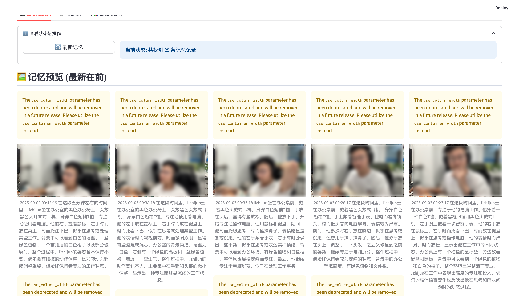

# HearthScribe: 基于文心大模型的个性化家庭记忆助手


## 1. 项目背景与场景价值
### 1.1. 项目简介

**HearthScribe** 是一个基于文心4.5系列大模型和树莓派4B构建的软硬件深度融合的AI硬件产品。它是一个永远在线、默默守护的“家庭记忆助手”，能够持续观察、理解并记录家庭场景中发生的事件，将日常生活的碎片化瞬间转化为结构化、可搜索、可交互的长期记忆。用户可以通过自然语言与它对话，回顾过去的点滴，获取指定时段的总结报告，从而弥补人类记忆的局限性，增进家庭成员间的情感连接。

### 1.2. 目标场景与用户痛点

在快节奏的现代生活中，我们常常会忘记日常生活中的细节：
- **家有老人/孩子：** 无法时刻陪伴，想知道他们白天的活动情况，是否按时吃饭、服药，有无异常行为。
- **宠物关怀：** 主人上班时，想了解宠物独自在家时的状态，是活泼玩耍还是焦虑不安。
- **个人生活记录：** 常常忘记物品放在何处，想不起某件重要的小事是何时发生的，例如“快递员是什么时候来的？”或“我昨天下午在做什么？”。

现有的智能摄像头大多聚焦于“安防”，提供的是原始、无组织的视频流，回顾查找效率极低。**HearthScribe** 旨在解决这一痛点，它不仅“看”，更“理解”和“记忆”，提供了一种全新的、有温度的家庭场景交互方式。

### 1.3. 解决方案与创新点

我们提出一个模拟人类记忆机制的解决方案，构建了一个四层智能系统：

1.  **感知层:** 利用端侧轻量级模型实时处理视觉信息，识别家庭成员和物体。
2.  **短期记忆流:** 将连续的视觉信息智能地切分成有意义的“事件片段”。
3.  **认知核心:** 调用云端文心视觉大模型（LVM），对“事件片段”进行深度理解和语言化总结。
4.  **长期记忆库:** 将总结后的事件存入端侧的向量数据库，形成永久的、可检索的记忆。

**创新点：**
*   **端云协同的混合架构：** 在资源有限的树莓派上运行实时性要求高的感知任务，并将需要强大认知能力的分析任务交由云端文心大模型处理，实现了成本与性能的最佳平衡。
*   **事件驱动的记忆生成：** 并非无差别地录制一切，而是通过智能算法判断“事件”的开始和结束，极大地减少了数据冗余，提升了记忆的“信噪比”。
*   **自然语言交互：** 用户可以通过Web界面或命令行，用日常语言进行提问、搜索记忆、生成分析报告，实现了真正意义上的人机自然交互。

## 2. 实现原理与技术架构
### 2.1. 系统架构图


### 2.2. 工作流程详解
1.  **数据采集与感知（端侧）：**
    *   `main_collector.py` 中的摄像头线程以最高效率从USB摄像头捕获视频帧。
    *   `perception_processor.py` 模块对每一帧进行处理。它首先使用轻量级的 **YOLOv8n** 模型进行高效的人物追踪，为每个人分配一个稳定的`track_id`。
    *   为了识别具体身份，模块会机会性地运行 **`face_recognition`** 库。一旦某个`track_id`成功关联到已知身份（如“lizhijun”），这个身份就会被“粘性”地记住，无需后续帧重复进行人脸识别，大大降低了计算开销。

2.  **短期记忆与事件打包（端侧）：**
    *   `memory_stream.py` 扮演短期记忆的角色。它根据感知处理器的输出，判断场景中是否“有人活动”。
    *   当活动开始时，它启动事件捕获，按一定间隔（如2秒）将关键帧存入缓冲区。
    *   当活动中断超过设定阈值（如30秒），或事件持续时间达到上限（如5分钟）时，它会将缓冲区内的所有关键帧打包成一个完整的“事件”，并传递给下一步处理。

3.  **认知理解与总结（云端）：**
    *   `cognitive_core.py` 接收到打包好的事件。它会挑选出数张最具代表性的关键帧图像。
    *   模块将这些图像和精心设计的Prompt一起发送给**文心视觉大模型** API。
    *   LVM对图像进行深度分析，理解其中人物的行为、互动和场景，并根据Prompt生成一段详细、流畅的JSON格式文本摘要，例如：`{"summary": "下午3点，lizhijun坐在沙发上，似乎正在使用笔记本电脑工作。"}`。

4.  **长期记忆存储与检索（端侧）：**
    *   `long_term_memory.py` 收到LVM返回的文本摘要。
    *   它使用 **`sentence-transformers`** 模型（在端侧运行）将文本摘要转换为高维向量。
    *   最后，将这个向量连同事件ID、时间戳、参与者、图片路径等元数据，一并存入本地的 **LanceDB** 向量数据库中。LanceDB是一个为AI设计的现代化列式数据库，非常适合在树莓派等边缘设备上运行。

5.  **交互与应用（端侧 + 云端）：**
    *   `app_streamlit.py` 提供了一个用户友好的Web界面。
    *   **记忆浏览：** 直接从数据库读取并展示所有记忆事件的摘要和预览图。
    *   **问答助手（RAG）：**
        1.  用户输入问题，如“lizhijun在喝水吗？”。
        2.  系统将问题文本转换为向量，在本地LanceDB中进行高效的相似性搜索，检索出最相关的几条记忆。
        3.  将这些记忆作为上下文（Context），连同用户问题一起发送给**文心语言大模型** API。
        4.  大模型基于提供的上下文，生成精准、自然的回答，并通过流式输出展示给用户。
    *   **分析报告：** 用户选定时间范围，系统检索出该时段所有记忆，并调用文心大模型生成一份结构化的分析报告。

## 3. 硬件方案说明
*   **主控核心：** **树莓派 4B (自备)** - 选用8GB内存版本，以确保流畅运行操作系统、Python环境以及多个AI模型。其优秀的社区支持和GPIO接口也为未来扩展提供了可能。
*   **视觉传感器：** **标准USB摄像头 (720p)** - 成本低廉，易于获取和配置。
*   **存储单元：** **64GB 高速MicroSD卡** - 用于安装操作系统、存储代码、依赖库、人脸数据以及长期记忆数据库。
*   **外设：** 5V/3A USB-C电源、散热风扇和外壳（保证长时间稳定运行）。


## 4. 使用说明与功能截图
### 4.1. 部署与准备
1.  **环境设置：** 在树莓派上安装Raspberry Pi OS，并根据 `requirements.txt` 配置好Python环境。
2.  **人脸录入：**
    *   在 `face_crops` 目录下，为每个家庭成员创建一个以其姓名命名的文件夹（例如 `lizhijun`）。
    *   运行 `python collect_faces.py` 脚本，摄像头会启动。请正对摄像头，脚本会自动检测并裁剪人脸图像，保存到 `face_crops/` 目录下。
    *   将裁剪好的、清晰的人脸图片移动到对应的姓名文件夹下。

### 4.2. 运行系统
1.  **启动核心服务：**
    ```bash
    python main_collector.py
    ```
    此时，HearthScribe已在后台开始静默工作，观察并记录家庭事件。

2.  **启动交互界面：**
    ```bash
    streamlit run tools/app_streamlit.py
    ```
    在浏览器中打开提示的URL（通常是 `http://<树莓派IP地址>:8501`），即可访问Web UI。

### 4.3. 功能界面展示

*   **[ 📷 记忆浏览器 ]**
    *   页面顶部以画廊形式展示最新记忆事件的预览图和摘要。
    *   下方是详细的记忆列表，包含精确时间、事件摘要和参与者，可滚动查看所有历史记录。

*   **[ 💬 问答助手 ]**
    *   一个聊天机器人界面。
    *   用户可以直接输入自然语言问题，如“今天下午家里有人来过吗？”或“猫咪大部分时间都在哪里睡觉？”。
    *   AI助手会根据记忆库检索到的信息给出回答。

*   **[ 📊 总结与分析 ]**
    *   用户可以选择一个起始和终止日期。
    *   点击“生成分析报告”后，AI会对这段时间内的所有记忆进行汇总分析，生成一份包含整体摘要、主要活动和行为模式的Markdown格式报告。




### 5. 成本测算
本项目的总成本由**硬件成本**（一次性投入）和**云端API成本**（持续性支出）两部分组成。此估算旨在评估项目在真实、持续使用场景下的长期运营成本。

#### 5.1. 硬件成本

硬件部分均为市售通用模块，成本透明且可控，总计**620元**。

| 部件名称 | 型号/规格 | 单价 (约人民币) | 数量 | 总计 (约人民币) | 备注 |
| :--- | :--- | :--- | :--- | :--- | :--- |
| 主控板 | 树莓派 4B (8GB) | 450元 | 1 | 450元 | 核心计算单元 |
| 摄像头 | 罗技 C270 或同级 | 80元 | 1 | 80元 | 视觉输入设备 |
| MicroSD卡 | 闪迪 64GB Class10 | 40元 | 1 | 40元 | 存储系统和数据 |
| 电源适配器 | 5V 3A Type-C | 30元 | 1 | 30元 | 稳定供电 |
| 散热套件 | 风扇+散热片 | 20元 | 1 | 20元 | 保证长时间运行稳定 |
| **硬件总成本** | | | | **620元** | |

#### 5.2. 云端API成本估算 (基于活跃使用场景)

API成本主要来自两个方面：**① 自动事件总结（视觉大模型）** 和 **② 用户交互式问答/分析（语言大模型）**。

##### ① 视觉大模型 (ERNIE-4.5-Turbo-VL) 成本 - 自动事件总结

这是系统后台自动运行产生的核心成本，也是最主要的支出（调用价格参考千帆平台）。

*   **价格:** 输入 ¥0.003 / 1k tokens, 输出 ¥0.009 / 1k tokens
*   **调用逻辑:** 根据代码设置，在检测到持续活动时，系统会**每5分钟** (`EVENT_MAX_DURATION_SECONDS`) 强制打包一次事件并调用LVM进行总结。

**估算假设 (基于“活跃家庭日”):**
*   **活跃时长:** 假设一天中，家庭成员在摄像头监控区域内的**累计活跃时间为 6 小时**。
*   **调用频率:** 在这6小时的活跃期内，每5分钟调用一次API。
*   **每日调用次数:** `(6 小时 * 60 分钟/小时) / 5 分钟/次 =` **72 次/天**
*   **单次调用负载:**
    *   **输入:** 发送5张关键帧图片 (约 `5 * 130 = 650 tokens`) + 文本Prompt (约 `300 tokens`) = **950 tokens** (0.95k tokens)。
    *   **输出:** LVM生成的JSON格式总结，平均长度约 **200 tokens** (0.2k tokens)。

**成本计算:**
*   **单次调用成本:**
    *   输入成本: `0.95k tokens * ¥0.003/k = ¥0.00285`
    *   输出成本: `0.2k tokens * ¥0.009/k = ¥0.0018`
    *   **合计:** `¥0.00285 + ¥0.0018 = ¥0.00465`
*   **每日成本:** `¥0.00465/次 * 72次/天 = ¥0.3348`
*   **每月成本 (30天):** `¥0.3348 * 30 ≈` **¥10.04/月**

##### ② 语言大模型 (ERNIE-4.5-Turbo-32K) 成本 - 用户交互

此成本与系统自动监控无关，完全取决于用户的交互频率。

*   **价格:** 输入 ¥0.0008 / 1k tokens, 输出 ¥0.0032 / 1k tokens

**估算假设 (基于“中度活跃用户”):**
*   **日常问答:** 每天 **10次** 记忆问答 (单次输入约0.42k tokens, 输出约0.15k tokens)。
*   **分析报告:** 每月生成 **4次** 周度分析报告 (单次输入约5.45k tokens, 输出约0.5k tokens)。

**成本计算:**
*   **每月问答成本:** `( (0.42k * ¥0.0008) + (0.15k * ¥0.0032) ) * 10次/天 * 30天 ≈` **¥0.24**
*   **每月报告成本:** `( (5.45k * ¥0.0008) + (0.5k * ¥0.0032) ) * 4次/月 ≈` **¥0.02**
*   **每月语言模型总成本:** `¥0.24 + ¥0.02 =` **¥0.26/月**

#### 5.3. 总成本估算

| 成本类别 | 费用明细 | 金额 (约人民币) | 备注 |
| :--- | :--- | :--- | :--- |
| **一次性成本** | **硬件总成本** | **¥620** | 购买设备所需 |
| **持续性成本** | 视觉大模型 (LVM) | ¥10.04 / 月 | 基于每日6小时活跃时间的估算 |
| | 语言大模型 (LLM) | ¥0.26 / 月 | 基于中度用户交互频率的估算 |
| | **每月API总成本** | **≈ ¥10.30** | |

